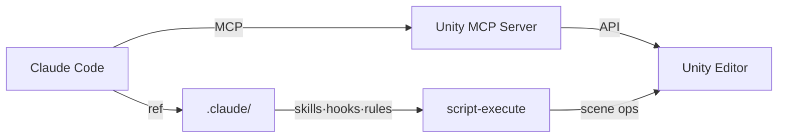
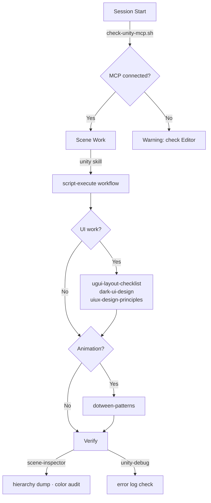

# CCUF — Claude Code Unity Framework

_Battle-tested guardrails for Unity + MCP._

**[한국어](docs/ko.md)**

---

A guardrail + skill framework for Unity projects powered by [Unity MCP](https://github.com/IvanMurzak/Unity-MCP).

Born from real production work — every rule exists because something broke without it.



---

## Why this exists

Other frameworks give you 47 agents and 72 skills.
This one gives you 7 skills and 2 hooks — all proven in production.

| Other frameworks | CCUF |
|------------------|------|
| "Follow CRAP principles" | Here's the exact RGB values that work |
| "Use LayoutGroup properly" | Here's 11 rules from actual bugs we hit |
| "Don't edit scene files directly" | Hook that blocks it before you can |
| 47 virtual studio members | 1 person + MCP = direct scene control |

---

## Prerequisites

- [Unity MCP](https://github.com/IvanMurzak/Unity-MCP) — Lets Claude Code talk directly to Unity Editor. Every skill in this framework depends on it. See that repo for installation.
- [Claude Code](https://claude.ai/claude-code)
- DOTween (optional — for `dotween-patterns` skill)

---

## Quick Start

```bash
# 1. Clone into your project
git clone https://github.com/user/CCUF.git /tmp/ccuf
cp -r /tmp/ccuf/.claude your-unity-project/.claude

# 2. Open Unity + start Claude Code in your project dir
cd your-unity-project
claude

# 3. Session starts → hook auto-checks MCP connection
# [CCUF] Unity MCP connected.

# 4. Start working
# "look at the scene" → /unity skill triggers
# "let's build UI" → ugui + dark-ui skills guide the work
# "add DOTween" → dotween-patterns keeps it safe
```

---

## User Flow

### First time setup

Install Unity MCP → Copy `.claude/` folder → Done.

### Every session



---

## What's Inside

### Skills (7)

| Skill | What it does |
|-------|-------------|
| `unity` | MCP editor interaction — script-execute patterns, wiring, screenshot workflow |
| `unity-debug` | Editor log parsing for compile/runtime errors |
| `ugui-layout-checklist` | 11 LayoutGroup rules from real bugs |
| `uiux-design-principles` | CRAP, Gestalt, visual hierarchy + 4 reference docs |
| `dark-ui-design` | Dark UI system — L1/L2/L3 values, button tiers, accent color |
| `dotween-patterns` | LayoutGroup-safe animation patterns |
| `scene-inspector` | script-execute diagnostic snippets |

### Hooks (2)

| Hook | Event | What it does |
|------|-------|-------------|
| `check-unity-mcp.sh` | SessionStart | Verifies CLI + Editor connection |
| `validate-scene-access.sh` | PreToolUse (Edit/Write) | Blocks direct .unity editing |

### Rules (3)

| Rule | Paths | What it enforces |
|------|-------|-----------------|
| `scene-safety.md` | `**/*.unity` | No direct scene read/write |
| `ugui-code.md` | `**/UI/**/*.cs` | LayoutElement-only sizing, ColorBlock white |
| `mcp-workflow.md` | `**/*.cs` | script-execute first, no agent delegation for complex UI |

### Docs (2)

| Doc | What it covers |
|-----|---------------|
| `known-pitfalls.md` | Every bug we hit — MCP, UGUI, design. With solutions. |
| `mcp-tool-guide.md` | Tool tier list by usage frequency. 80% of work = 3 tools. |

---

## Philosophy

- **Bottom-up.** Every rule here was a bug first.
- **Concrete.** RGB values, not "use appropriate contrast."
- **Lean.** 7 skills that all get used > 72 that mostly don't.
- **MCP-native.** AI controls the editor, not just writes code.

---

## License

MIT
