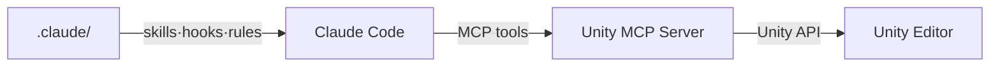
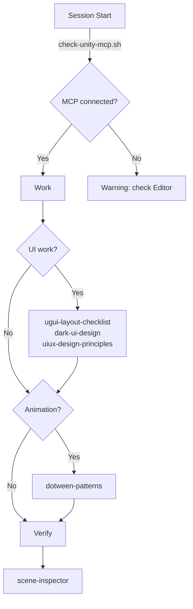

# CCUF — Claude Code Unity Framework

_Battle-tested guardrails for Unity + MCP._

**[한국어](docs/ko.md)**

---

A guardrail + skill framework for Unity projects powered by [Unity MCP](https://github.com/IvanMurzak/Unity-MCP).

Born from real production work — every rule exists because something broke without it.



---

## Demo

[](https://www.youtube.com/watch?v=d__GrO9W2Dk)

---

## Why this exists

Typing "don't edit .unity files" every session gets old.
So does re-explaining LayoutGroup rules, color systems, and MCP patterns.

This framework turns those repeated instructions into persistent guardrails.

| Without CCUF | With CCUF |
|--------------|-----------|
| "Remember to use LayoutElement, not sizeDelta" | Rule auto-loads when you touch UI code |
| "Check if MCP is connected first" | Hook checks on session start |
| "Use these L1/L2/L3 color values..." | Skill provides exact RGB values on demand |
| "Don't edit the .unity file directly" | Hook blocks it before it happens |

---

## ⚠️ Cost Warning

This framework relies on [Unity MCP](https://github.com/IvanMurzak/Unity-MCP), which gives Claude Code direct access to the Unity Editor. That means Claude reads scene hierarchies, dumps component data, and executes C# scripts — all of which consume tokens.

A single UI remaster session can easily burn **100k–300k+ tokens**. If you're on a metered plan, monitor your usage carefully.

> **Recommended plan:** Claude Max ($100/mo or $200/mo) for unlimited usage.
> On pay-per-token plans, a heavy scene manipulation session could cost **$5–15+** in a single sitting.

Skills and rules themselves are lightweight (loaded on demand, ~100–500 tokens each). The cost comes from MCP tool calls — especially `script-execute` dumps and screenshot verification loops.

---

## Prerequisites

- [Unity MCP](https://github.com/IvanMurzak/Unity-MCP) — Lets Claude Code talk directly to Unity Editor. Every skill in this framework depends on it. See that repo for installation.
- [Claude Code](https://claude.ai/claude-code)
- DOTween (optional — for `dotween-patterns` skill)

---

## Quick Start

```bash
# 1. Clone into your project
git clone https://github.com/wooson00308/CCUF.git /tmp/ccuf
cp -r /tmp/ccuf/.claude your-unity-project/.claude

# 2. Open Unity + start Claude Code in your project dir
cd your-unity-project
claude

# 3. Session starts → hook auto-checks MCP connection
# [CCUF] Unity MCP connected.

# 4. Start working
# "let's build UI" → ugui + dark-ui skills guide the work
# "add DOTween" → dotween-patterns keeps it safe
# MCP workflow rules are always active
```

---

## User Flow

### First time setup

Install Unity MCP → Copy `.claude/` folder → Done.

### Every session



---

## What's Inside

### Skills (5)

| Skill | What it does |
|-------|-------------|
| `ugui-layout-checklist` | 11 LayoutGroup rules from real bugs |
| `uiux-design-principles` | CRAP, Gestalt, visual hierarchy + 4 reference docs |
| `dark-ui-design` | Dark UI system — L1/L2/L3 values, button tiers, accent color |
| `dotween-patterns` | LayoutGroup-safe animation patterns |
| `scene-inspector` | script-execute diagnostic snippets |

### Hooks (2)

| Hook | Event | What it does |
|------|-------|-------------|
| `check-unity-mcp.sh` | SessionStart | Verifies CLI + Editor connection |
| `validate-scene-access.sh` | PreToolUse (Edit/Write) | Blocks direct .unity editing |

### Rules (2)

| Rule | What it enforces |
|------|-----------------|
| `unity-mcp-workflow.md` | Always loaded. Scene safety, script-execute patterns, screenshot method, error checking, tool priority. The core MCP workflow. |
| `ugui-code.md` | Path-gated (`**/UI/**/*.cs`). LayoutElement-only sizing, ColorBlock white, no magic numbers. |

### Docs (2)

| Doc | What it covers |
|-----|---------------|
| `known-pitfalls.md` | Every bug we hit — MCP, UGUI, design. With solutions. |
| `mcp-tool-guide.md` | Tool tier list by usage frequency. 80% of work = 3 tools. |

---

## Philosophy

- **Bottom-up.** Every rule here was a bug first.
- **Concrete.** RGB values, not "use appropriate contrast."
- **Lean.** 7 skills that all get used > 72 that mostly don't.
- **MCP-native.** AI controls the editor, not just writes code.

---

## License

MIT
