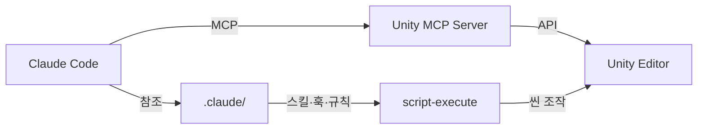
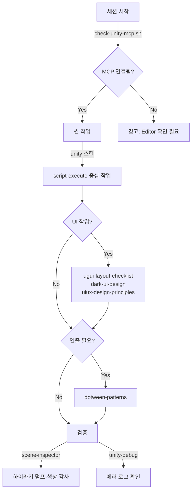

# CCUF — Claude Code Unity Framework

_Unity MCP로 에디터를 직접 제어하는 실전 가드레일 프레임워크._

**[English](../README.md)**

---

[Unity MCP](https://github.com/IvanMurzak/Unity-MCP) 기반의 스킬 + 가드레일 프레임워크입니다.

실제 프로젝트에서 겪은 문제들을 해결하면서 만들어졌습니다. 모든 규칙은 버그에서 시작됐습니다.



---

## 왜 만들었나

매 세션마다 ".unity 파일 직접 편집하지 마" 라고 타이핑하는 건 비효율적입니다.
LayoutGroup 규칙, 색상 체계, MCP 패턴을 매번 다시 설명하는 것도 마찬가지입니다.

이 프레임워크는 반복되는 지시를 영구적인 가드레일로 바꿔줍니다.

| CCUF 없이 | CCUF 있으면 |
|-----------|------------|
| "LayoutElement 써, sizeDelta 말고" | UI 코드 건드리면 규칙이 자동 로드됩니다 |
| "MCP 연결부터 확인해" | 세션 시작 시 훅이 자동 확인합니다 |
| "이 L1/L2/L3 컬러값 써..." | 스킬이 정확한 RGB 값을 제공합니다 |
| ".unity 파일 직접 편집하지 마" | 훅이 편집 전에 차단합니다 |

---

## ⚠️ 요금 경고

이 프레임워크는 [Unity MCP](https://github.com/IvanMurzak/Unity-MCP)를 통해 Claude Code가 Unity Editor를 직접 제어합니다. 씬 하이라키 조회, 컴포넌트 데이터 덤프, C# 스크립트 실행 — 전부 토큰을 소모합니다.

UI 리마스터 세션 한 번에 **10만~30만+ 토큰**을 쉽게 사용합니다. 종량제 플랜이라면 사용량을 주의 깊게 모니터링하세요.

> **권장 플랜:** Claude Max ($100/월 또는 $200/월) 무제한 사용.
> 토큰 종량제에서 씬 조작이 많은 세션 한 번에 **$5~15+** 가 발생할 수 있습니다.

스킬과 규칙 자체는 가볍습니다 (필요할 때만 로드, 각 100~500 토큰). 비용은 MCP 도구 호출에서 발생합니다 — 특히 `script-execute` 덤프와 스크린샷 검증 루프가 큽니다.

---

## 요구사항

- [Unity MCP](https://github.com/IvanMurzak/Unity-MCP) — Claude Code에서 Unity Editor를 직접 조작할 수 있게 하는 MCP 서버입니다. 이 프레임워크의 모든 스킬이 이를 전제로 동작합니다. 설치 방법은 해당 레포를 참고하세요.
- [Claude Code](https://claude.ai/claude-code)
- DOTween (선택 — `dotween-patterns` 스킬 사용 시)

---

## 빠른 시작

```bash
# 1. 프로젝트에 복사
git clone https://github.com/wooson00308/CCUF.git /tmp/ccuf
cp -r /tmp/ccuf/.claude your-unity-project/.claude

# 2. Unity를 열고 프로젝트 디렉토리에서 Claude Code를 실행합니다
cd your-unity-project
claude

# 3. 세션 시작 시 훅이 MCP 연결을 자동 확인합니다
# [CCUF] Unity MCP 연결 확인됨.

# 4. 작업을 시작합니다
# "씬 봐줘" → /unity 스킬 트리거
# "UI 만들자" → ugui + dark-ui 스킬이 가이드
# "DOTween 넣자" → dotween-patterns로 안전하게
```

---

## 사용 플로우

### 최초 세팅

Unity MCP 설치 → `.claude/` 폴더 복사 → 끝.

### 매 세션



---

## 구성 요소

### 스킬 (5개)

| 스킬 | 역할 |
|------|------|
| `ugui-layout-checklist` | 실제 버그에서 나온 LayoutGroup 규칙 11개 |
| `uiux-design-principles` | CRAP, 게슈탈트, 시각적 위계, 간격 이론 + 레퍼런스 4개 |
| `dark-ui-design` | 다크 UI 실전 체계 — L1/L2/L3 RGB 값, 버튼 티어, 액센트 컬러 |
| `dotween-patterns` | LayoutGroup 안전한 애니메이션 패턴 |
| `scene-inspector` | script-execute 진단 스니펫 모음 |

### 훅 (2개)

| 훅 | 이벤트 | 역할 |
|---|--------|------|
| `check-unity-mcp.sh` | SessionStart | unity-mcp-cli 설치 확인 + Editor 연결 확인 |
| `validate-scene-access.sh` | PreToolUse | .unity 파일 직접 편집 차단 |

### 규칙 (2개)

| 규칙 | 내용 |
|------|------|
| `unity-mcp-workflow.md` | 항상 로드. 씬 안전, script-execute 패턴, 스크린샷 방법, 에러 확인, 도구 우선순위. MCP 워크플로우 핵심. |
| `ugui-code.md` | 경로 조건부 (`**/UI/**/*.cs`). LayoutElement만 크기 제어, ColorBlock white 필수. |

### 문서 (2개)

| 문서 | 내용 |
|------|------|
| `known-pitfalls.md` | 실제로 겪은 모든 버그와 해결법 |
| `mcp-tool-guide.md` | 실전 사용 빈도 기반 도구 티어 분류 |

---

## 철학

- **바텀업.** 모든 규칙은 먼저 버그였습니다.
- **구체적.** "적절한 대비를 사용하세요" 대신 RGB 값을 제공합니다.
- **군더더기 없이.** 전부 쓰이는 7개 스킬이 대부분 안 쓰이는 72개 스킬보다 낫습니다.
- **MCP 네이티브.** "AI가 코드를 생성"이 아니라 "AI가 에디터를 조작"합니다.

---

## 라이선스

MIT
